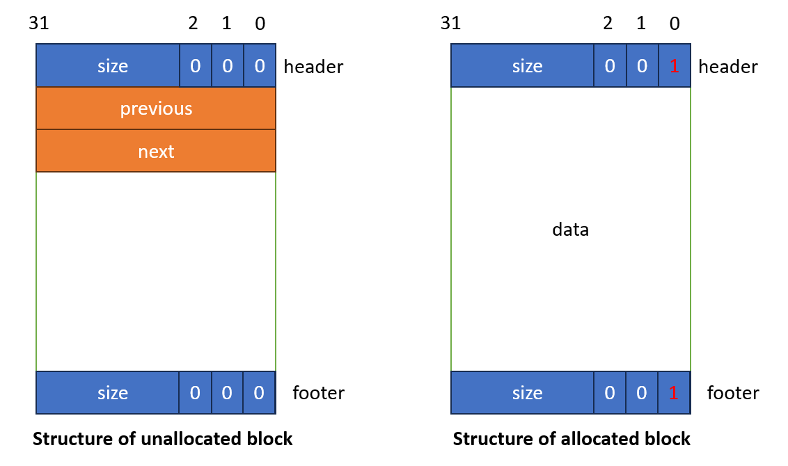
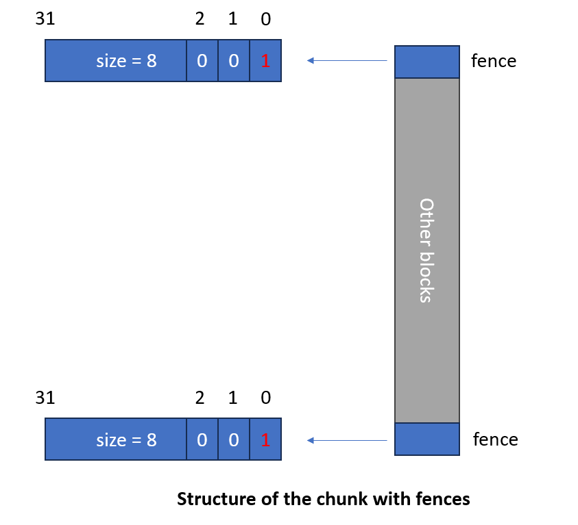

# Report
## Overview
### Block structure
The block structure is modified to images shown below. It has two different structures when the block is allocated and 
unallocated.

The structure contains a header (8 bytes), data block and a footer (8 bytes).

The last 3 bits in size is preserved to represent the status of allocation. The macro function `GET_SIZE` will return
the real size by calculating AND with mask of 0b111 and header. The `IS_ALLOC` will return whether the block is allocated by 
calculating AND the header with 0b1.

As in this structure the unallocated block saves two pointers after the header metadata block, the minimum
rounded size to allocate is 16 bytes instead of 8 bytes.

## Chunk structure
For the whole chunk, two fence blocks are set at the beginning and at the end, each 8 bytes with size 8 and allocatation
status true. In other words, they are two allocated blocks only contain a metadata block.

## Free list structure
In my code, I created an array of size `N_LISTS` (59) to save the beginning of the linked lists of 2 * 8 bytes, 3 * 8 bytes ...
 until (59 + 1) * 8 bytes. As the minimum allocation size is 16 bytes, it saved one array to store 1 * 8 bytes. The index is 
calculated as `size/kMinAllocationSize-2` where kMinAllocationSize is still 8, not 16.

If the block size is larger than the n * 8 bytes, it will be saved to the linked list in `other_list`.

## Code review
### Functions
`init_chunk` and `init_fence` are two helper functions to init a chunk at the beginning.

`Block *find_fit` is a function to find a proper block meeting the requested size. If there is no such block ,return NULL.

`void *allocate` is the function called inside the previous function. It will be called when there is a block meeting the size
requirement to allocate the block to return. It will also delete the free block from lists and clear pointer info.

`Block *split_block` will split the input block and return the right most one with the exact size requested.

`void delete_from_list` `void add_to_list` `void update_footer` are helper functions to update lists and footer info by
copying info from header to footer.

`Block *extend` will call `mmap` again to extend current chunk when there is no enough space or proper block to meet 
size requirement. It will return the new block requested to meet the requirement.

## Variables
`chunk_b` saves the beginning address of the current chunk.

`fence_b` and `fence_e` save the addresses of the fences at the beginning and at the end.

`free_list[N_LISTS]` saves the address of the first element in the multiple free lists according to there size.

## Implementation
### Free list
In multiple free lists and other size list, the blocks are linked using a linked list. After the metadata block, 
two pointers are saved pointing to the previous and next free block within the same list in terms of size.

Anytime `my_malloc` is called, it will first look for whether there is some element in the list using the index corresponding
to the size. If there is no element in multiple free lists that are large enough, it will go on looking for elements by iterating in other size
blocks. If there is still no one available, it will call `extend` to request extra chunks reusing mmap.

### Optimization
#### Metadata reduction
As the size will be rounded up to 8*n, (actually it begins from 16), the last three bits will be all 0.
In my code, I used the last bit to save the status of allocation, 1 represent it has been allocated and 0 represents not.
#### Constant time coalesce
In the process of coalesce, the current block will find the previous block using size save in its footer which is just 8 bytes left than the
header of the current block, and next block by using the size saved in its own header.

In this way, we only need to use constant time to find the status of previous and next blocks of the current one.